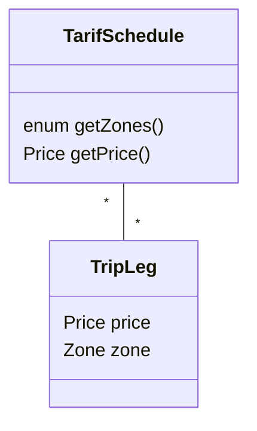
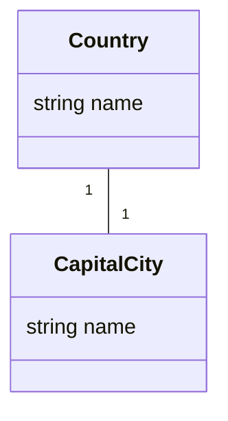
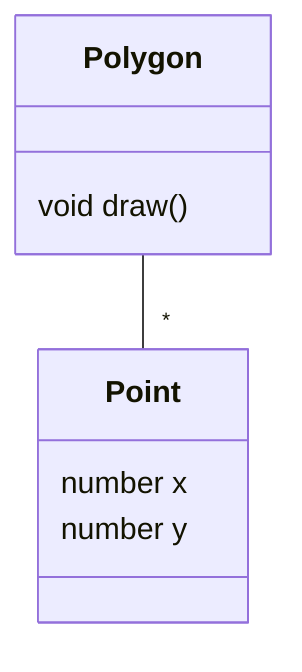
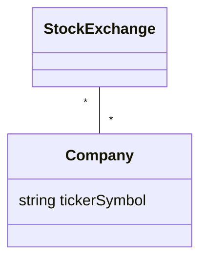

Associations denote relationships between classes.

The multiplicity of an association end denotes how many objects the instance of a class can legitimately reference.

^overview
## 1-to-1 Associations

## 1-to-Many Associations

## Many-to-Many Associations
