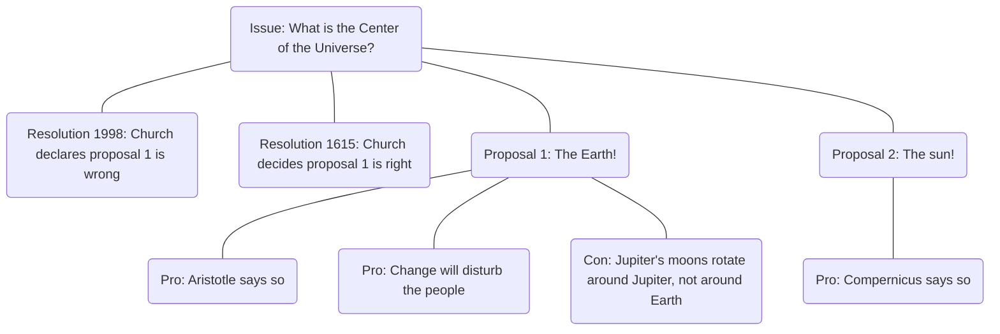

## What is the center of the universe?
- Church
    - The Earth is the center of the universe
    - Why? Aristotle says so
- Galileo
    - The sun is the center of the universe
    - Why? Copernicus says so
    - Also, the Jupiter's moons rotate around Jupiter, not Earth
## Issue Modeling

## The "Bermuda Triangle" of Modeling

You are both forward and reverse-engineering models and connecting them.