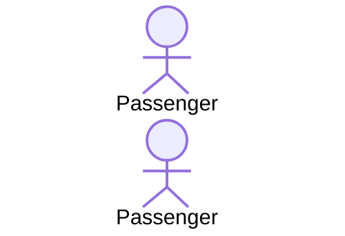

Describe the functional behavior of the system as seen by the user
- Used during requirements elicitation and analysis to represent external behavior
- An Actor represents a role

- A use-case represents a class of functionality provided by the system
- The textual use-case description consists of 6 parts...
    1. Unique name
    2. Participating actors
    3. Entry conditions
    4. Exit conditions
    5. Flow of events
    6. Special Requirements
## <<extends\>> relationship
- Used to extend use-cases
- 
## <<includes\>> relationship
- Represents functionality in more than one use-case
- 