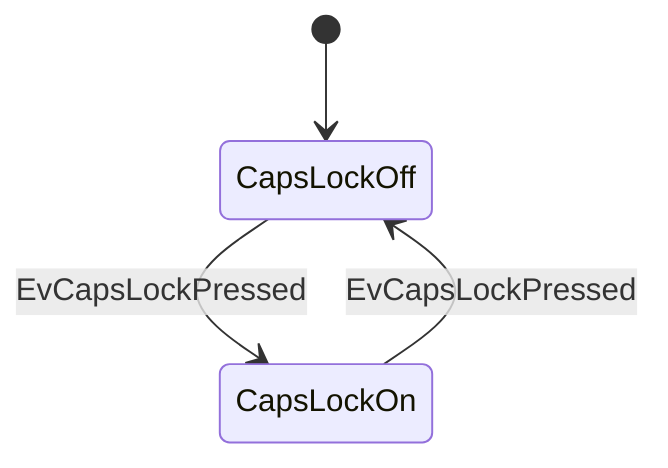

Behavioral Things are the dynamic parts of UML models.
## Interaction
Events in a state machine, e.g. `EvCapsLockPressed` in the state machine below.
## State Machine

```mermaid
stateDiagram-v2
    [*] --> CapsLockOff
    CapsLockOff --> CapsLockOn : EvCapsLockPressed
    CapsLockOn --> CapsLockOff : EvCapsLockPressed
```
