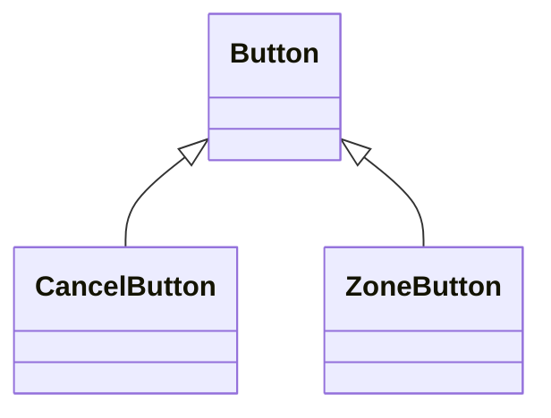

Another special case of an association denoting a "kind-of" hierarchy.

Simplifies the analysis model by introducing taxonomy. The children classes inherit the attributes and operations of parent classes.

^main