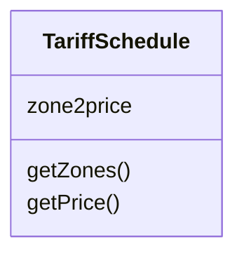

A class represents a concept.
- Encapsulates state (attributes) and behavior (operations)
    - Each attribute has a type
    - Each operation has a signature
- The class name is the only mandatory information

^main

([[ser216.uml.diagrams.class]])