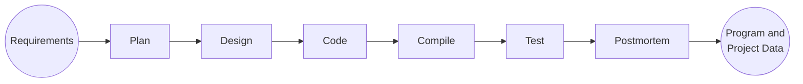
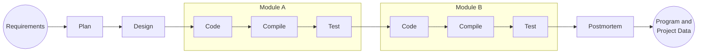

Software now controls most systems- business, finance, military, etc. The cost, schedule and quality of software is now a critical business concern.

## Big projects frequently fail

- With increased scale, projects are more troubled
- | Project Size    | People | Time (Months) | Success Rate |
  | --------------- | ------ | ------------- | ------------ |
  | Less than $750K | 6      | 6             | 55%          |
  | $750K to $1.5M  | 12     | 9             | 33%          |
  | $1.5M to $3M    | 25     | 12            | 25%          |
  | $3M to $6M      | 40     | 18            | 15%          |
  | $6M to $10M     | +250   | +24           | 8%           |
  | Over $10M       | +500   | +36           | 0%           |
- This is a problem of scale- current practices do not scale up

## Why projects fail

- Large and small projects fail for four reasons
  - Project commitments are unrealistic
  - The larger the project, the less influence engineers have
  - If engineers don't have anything to say, nobody will listen
  - Larger projects are harder to control
- Today, few developers have personal plans
  - Without plans, you cannot know job status
  - If you don't know where you are, management can't understand job status
  - If management doesn't understand job status, they can't manage projects
- Quality problems get worse at scale
  - If any part has quality problems, the system will have quality problems
  - If developers do not manage quality, their teams cannot manage quality
  - When unmanaged, quality will always be poor
- To be effective, teams need leadership and coaching
  - Leaders build team motivation and commitment
  - Coaching develops team cohesion
  - Cohesive, motivated, and committed teams do the best work

---

## PSP Principles

- The quality of a software system is determined by the _quality of its worst components_
- The quality of a software component is governed by the individual who developed it
- The quality of a software component is governed by the quality of the process used to develop it
- The key to quality is the individual developer’s skill, commitment, and personal process discipline
- As a software professional, you are responsible for your personal process
- You should measure, track, and analyze your work
- You should learn from your performance variations
- You should incorporate lessons learned into your personal practices

## What does PSP provide?

- A stable, mature PSP allows you to...
  - Estimate and plan your work
  - Meet your commitments
  - Resist unreasonable commitment pressures
- You will also...
  - Understand your current performance
  - Be better equipped to improve your capability
- The PSP provides…
  - A proven basis for developing and using an industrial-strength personal process
  - A discipline that shows you how to improve your personal process
  - The data to continually improve the productivity, quality, and predictability of your work

## What is the PSP?

- The PSP is a personal process for developing software or for doing any other defined activity
- The PSP includes...
  - Defined steps
  - Forms
  - Standards
- It provides a measurement and analysis framework for characterizing and managing your personal work
- It is also a defined procedure that helps you to improve your personal preference

## The PSP process flow


## Learning the PSP

- The PSP is introduced in six upward-compatible steps
- You write one or more module-sized programs at each step
- You gather and analyze data on your work
- You use the results to improve your personal performance
- PSP0: You establish a measured performance baseline.
- PSP1: You make size, resource, and schedule plans.
- PSP2: You practice defect and yield management.
  

---

## Phase order

- The PSP looks like a waterfall process, but it's not
  - The phase order is determined by the dependencies between phases
- Start with a plan
- ```mermaid
  flowchart BT
      Plan --> Design
      Design --> Code
      Code --> Compile
      Compile --> Test
  ```

## Process flow

- When programs are small or well understood, you can execute the phases in order...
  1. Produce a plan
  2. Design all modules
  3. Code all modules
  4. Compile the coded program
  5. Summarize the project data during the postmortem



^process-flow

## Cyclic Process flow

- Large programs or those that are not well understood may require an iterative approach
- Two modules are identified during the design- A and B
- Each module is separately coded, compiled, and tested



- There can be more than two cycles & modules

## Process scripts

- Process scripts provide "expert-level" guidance on how to use the process
  - They are one or two pages long
  - They describe...
    - Purpose
    - Entry criteria
    - General guidelines
    - Steps
    - Exit criteria

## PSP Scripts

- Planning
  - Estimate the development time
- Development
  - Develop the product using your current methods
- Postmortem
  - Complete the project plan summary with the time spent
  - Defects found and injected in each phase
- Design
  - Design the program using your current design methods
- Coding
  - Implement the program
- Compile
  - Compile until defect-free
- Test
  - Test the program and fix all defects
- Record defects in the defect log and time per phase in the time log

## Using Process Scripts

- Process scripts guide you through the process
- You should
  - Check the entry criteria before starting a phase
  - Record the phase start time
  - Perform the phase steps and instructions
  - Record defects as they are found and corrected
  - Check the exit criteria before ending a phase
  - Record the phase end time
  - Go to the next phase
- Force yourself to use this paradigm until it becomes a habit

## PSP Measures and Forms

- PSP measures...
  - Time
    - Track time in phase
  - Defects
    - Record defects as they are found and fixed
- PSP has four forms:
  - PSP Project Plan Summary
    - Summarizes planned and actual time and defects by phase
  - PSP Time Recording Log
    - Used to record time
  - PSP Defect Recording Log
    - Used to record defects
  - PSP Defect Type Standard
    - Used to define standard defect types
