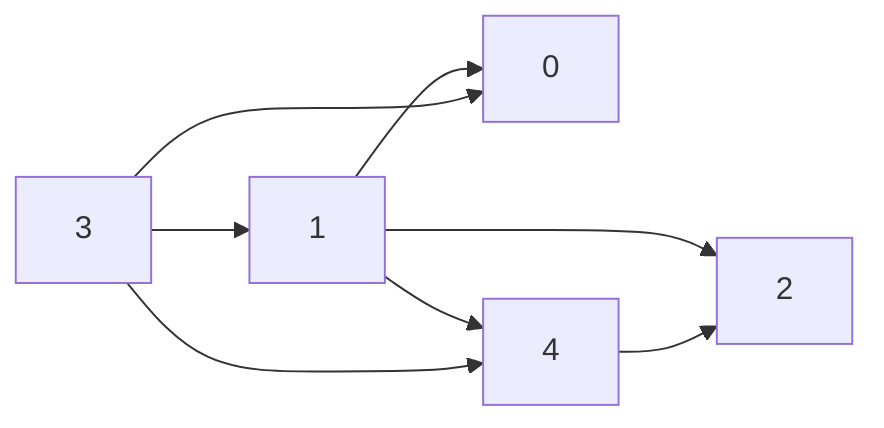

An ordered list of vertices in a graph such that all dependencies are listed before their dependent.


This is **not** possible if there is a cyclic graph, which causes the [[ser222.directed-graphs.problems.directed-cycle]] problem.

## Order class

```java
public class DepthFirstOrder {
    private boolean[] marked;
    private Queue<Integer> pre;
    private Stack<Integer> reversePost;

    public DepthFirstOrder(Digraph G) {
        pre = new Queue<Integer>();
        reversePost = new Stack<Integer>();
        marked = new boolean[G.V()];
        for (int v = 0; v < G.V(); v++)
            if (!marked[v]) dfs(G, v);
    }

    private void dfs(Digraph G, int v) {
        marked[v] = true;
        for (int w : G.adj(v))
            if (!marked[w]) dfs(G, w);
        pre.enqueue(v);
        reversePost.push(v);
    }

    public Iterable<Integer> reversePost() {
        return reversePost;
    }
}
```

## Post-order example



- `DFS(3)`
    - `DFS(0)`
    - `DFS(1)`
        - `DFS(2)`
        - `DFS(4)`

Preorder: 3, 0, 1, 2, 4

Postorder: 0, 2, 4, 1, 3

Reverse post: 3, 1, 4, 2, 0

## Topological class

```java
public Topological {
    private Iterable<Integer> order;

    public Topological(Digraph G) {
        DirectedCycle finder = new DirectedCycle(G);
        if (!finder.hasCycle()) {
            DepthFirstOrder dfs = new DepthFirstOrder(G);
            order = dfs.reversePost();
        }
    }

    public Iterable<Integer> order() {
        return order;
    }

    public boolean isDAG() {
        return order == null;
    }
}