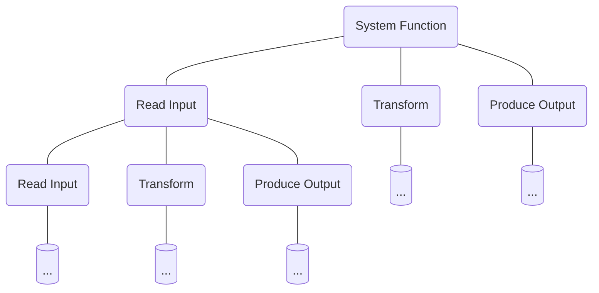
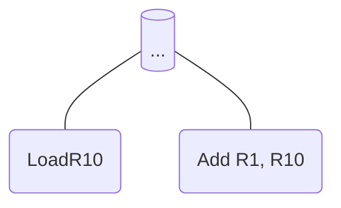

- In Functional Decomposition, the system is decomposed into models
- Each model is a major processing step
- Modules can be decomposed into smaller modules.

...which eventually leads to something like

## Why is Functional Decomposition Important?

- Functionality is spread across the system
- Maintainer must understand the whole system to make a single change
- Consequences...
  - Code that is hard to understand
  - Code that is complex and impossible to maintain
- Example: [[PowerPoint Autoshapes|ser216.introduction.decomposition.functional.autoshape]]
