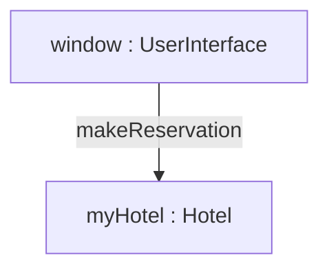
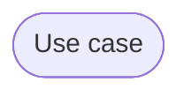
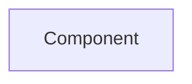
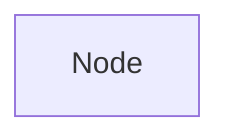

Structural things are used to define the static parts of models, representing physical and conceptual elements.

## Class
Represents a set of objects having similar responsibilities

|Class|
|-|
|Attributes|
|Operations|

## Interface
Defines a set of operations which specify the responsiblity of the class

|Interface|
|-|
||

## Collaboration
Defines an interaction between elements.

## Use Case
A set of actions performed by a system for a specific goal.

## Component
A physical part of a system

## Node
A physical element that exists at run-time

An edge between two notes denotes a relationship between the corresponding entities.