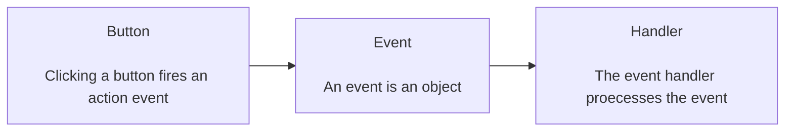
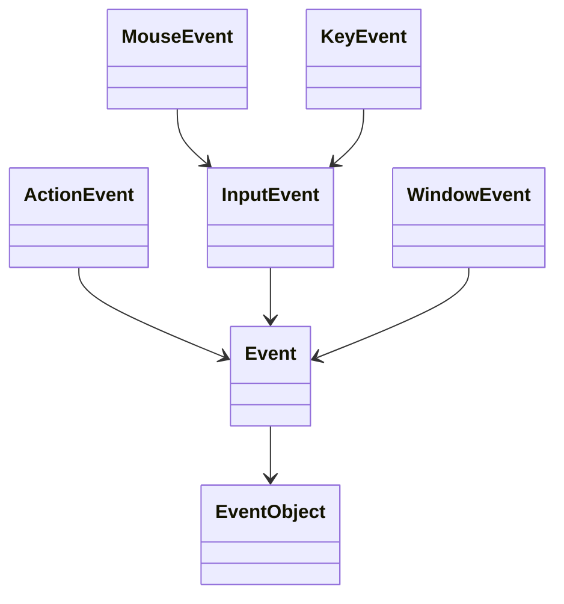

## Procedural vs event-driven programming

- Procedural code is executed in procedural order- by line
    - This is ideal for code that does not need to wait for other code to finish
- *Event-driven* code is executed when an event occurs
    - This is ideal for handling user input and other events that may occur at any time

## GUI events

- Source object (e.g. button)
- Event object (e.g. mouse click)
- Listener/handler object
    - Contains a method for processing the event
    - In languages that support functional programming, this can just be a private function or lambda expression



## Example of java event handling

```java
public class HandleEvent extends Application {
    public void start(Stage primaryStage) {
        ...
        // "okButton" is a button object
        // "cancelButton" is a button object
        OKHandlerClass handler1 = new OKHandlerClass();
        okButton.setOnAction(handler1);
        CancelHandlerClass handler2 = new CancelHandlerClass();
        cancelButton.setOnAction(handler2);
        ...
        primaryStage.show();
    }
}

class OKHandlerClass implements EventHandler<ActionEvent> {
    public void handle(ActionEvent event) {
        ... // will be called when the "okButton" is clicked
    }
}

class CancelHandlerClass implements EventHandler<ActionEvent> {
    public void handle(ActionEvent event) {
        ... // will be called when the "cancelButton" is clicked
    }
}
```

## Events

- An event is a type of signal to the program that something has happened
- An event is often generated by external entities (e.g. a user or another program)

## Event classes



These classes are found in the JavaFX event package. Subclasses of `EventObject` deal with events such as...

- Button actions
- Window events
- Mouse movements
- Keystrokes

## Common events


## The delegation model

```java
var okButton = new Button("OK");
var handler = new OKHandlerClass();
okButton.setOnAction(handler);
```

## Inner class listeners

- A listener class is designed to create a listener object for a specific event
- Because the listener class is only designed for a specific event, it is not reusable
- This makes it ideal to use a private or inner class to handle the event
- Because the listener class will only be used for one event, it can also be declared as a static class to avoid the need to instantiate it

## Inner classes

- An inner class is a class inside another class
- This can make programs simple and allowing access to the internal state of the classes, eliminating the need to pass the parent class as a parameter