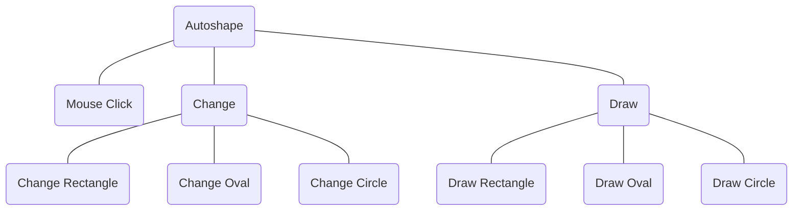

- If there is a small issue with one of the shapes, it is incredibly difficult to fix
- Adding a new shape generally requires code reuse, also requiring a good understanding of the system

Effectively you keep breaking down high level functions into smaller functions until you reach the actual code.
