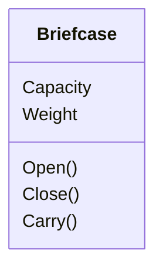
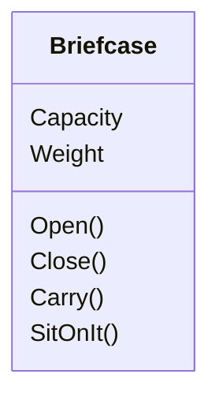

## A new use

## Questions

- Why did we model the thing as "Briefcase"?
  - The picture looked like a briefcase
- What do we do if the `SitOnIt()` operation is the most frequently used operation?
- What if briefcase is only used for sitting on it and never opened/closed?
    - We've made a modeling mistake!