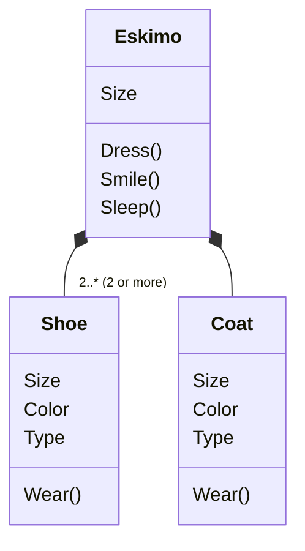
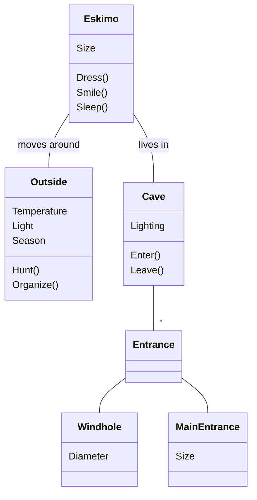

```mermaid
classDiagram
    class Eskimo {
        Size
        Dress()
        Smile()
        Sleep()
    }
    Eskimo *-- "2..* (2 or more)" Shoe
    class Shoe {
        Size
        Color
        Type
        Wear()
    }
    Eskimo *-- Coat
    class Coat {
        Size
        Color
        Type
        Wear()
    }
```
Iterative modeling could lead to...

```mermaid
classDiagram
    class Eskimo {
        Size
        Dress()
        Smile()
        Sleep()
    }
    Eskimo -- Outside : moves around
    class Outside {
        Temperature
        Light
        Season
        Hunt()
        Organize()
    }
    Eskimo -- Cave : lives in
    class Cave {
        Lighting
        Enter()
        Leave()
    }
    Cave -- "*" Entrance
    Entrance -- Windhole
    class Windhole {
        Diameter
    }
    Entrance -- MainEntrance
    class MainEntrance {
        Size
    }
```
...but is this the right model?

If it was an eskimo, yes, but it could have been a [[ser216.introduction.decomposition.object-oriented.face]].