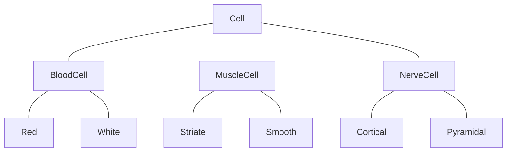

(aka Taxonomy)

```mermaid
flowchart TD
    Cell --- BloodCell
    Cell --- MuscleCell
    Cell --- NerveCell
    MuscleCell --- Striate
    MuscleCell --- Smooth
    BloodCell --- Red
    BloodCell --- White
    NerveCell --- Cortical
    NerveCell --- Pyramidal
```