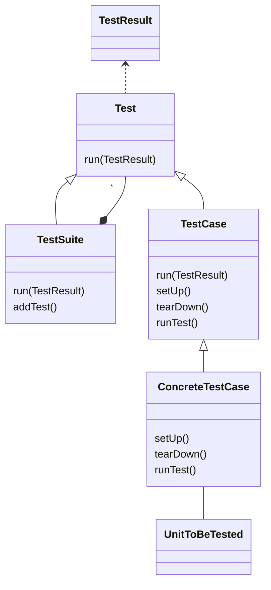

Java framework for writing and running [[unit tests|ser216.unit-testing]].

## Classes

## Other features

- GUI interface
- [Integration with Visual Studio Code](https://code.visualstudio.com/docs/java/java-testing)