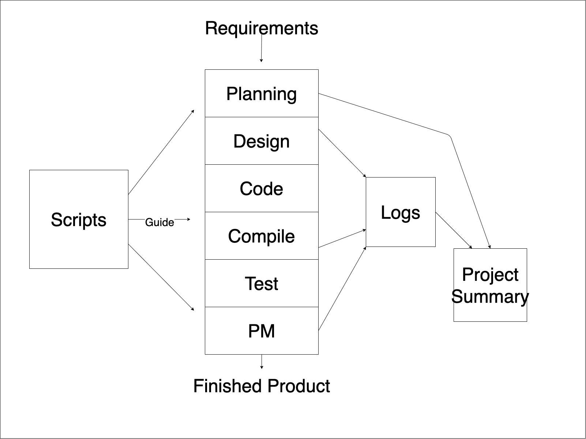

Software now controls most systems- business, finance, military, etc. The cost, schedule and quality of software is now a critical business concern.

## Big projects frequently fail
- With increased scale, projects are more troubled
- 
    | Project Size    | People | Time (Months) | Success Rate |
    | --------------- | ------ | ------------- | ------------ |
    | Less than $750K | 6      | 6             | 55%          |
    | $750K to $1.5M  | 12     | 9             | 33%          |
    | $1.5M to $3M    | 25     | 12            | 25%          |
    | $3M to $6M      | 40     | 18            | 15%          |
    | $6M to $10M     | +250   | +24           | 8%           |
    | Over $10M       | +500   | +36           | 0%           |
- This is a problem of scale- current practices do not scale up
## Why projects fail
- Large and small projects fail for four reasons
    - Project commitments are unrealistic
    - The larger the project, the less influence engineers have
    - If engineers don't have anything to say, nobody will listen
    - Larger projects are harder to control
- Today, few developers have personal plans
    - Without plans, you cannot know job status
    - If you don't know where you are, management can't understand job status
    - If management doesn't understand job status, they can't manage projects
- Quality problems get worse at scale
    - If any part has quality problems, the system will have quality problems
    - If developers do not manage quality, their teams cannot manage quality
    - When unmanaged, quality will always be poor
- To be effective, teams need leadership and coaching
    - Leaders build team motivation and commitment
    - Coaching develops team cohesion
    - Cohesive, motivated, and committed teams do the best work
---
## PSP Principles
- The quality of a software system is determined by the *quality of its worst components*
- The quality of a software component is governed by the individual who developed it
- The quality of a software component is governed by the quality of the process used to develop it
- The key to quality is the individual developer’s skill, commitment, and personal process discipline
- As a software professional, you are responsible for your personal process
- You should measure, track, and analyze your work
- You should learn from your performance variations
- You should incorporate lessons learned into your personal practices
## What does PSP provide?
- A stable, mature PSP allows you to...
    - Estimate and plan your work
    - Meet your commitments
    - Resist unreasonable commitment pressures
- You will also...
    - Understand your current performance
    - Be better equipped to improve your capability
- The PSP provides…
    - A proven basis for developing and using an industrial-strength personal process
    - A discipline that shows you how to improve your personal process
>     - The data to continually improve the productivity, quality, and predictability of your work
## What is the PSP?
- The PSP is a personal process for developing software or for doing any other defined activity
- The PSP includes...
    - Defined steps
    - Forms
    - Standards
- It provides a measurement and analysis framework for characterizing and managing your personal work
- It is also a defined procedure that helps you to improve your personal preference
## The PSP process flow

## Learning the PSP
- The PSP is introduced in six upward-compatible steps
- You write one or more module-sized programs at each step
- You gather and analyze data on your work
- You use the results to improve your personal performance
- PSP0: You establish a measured performance baseline. - PSP1: You make size, resource, and schedule plans.
- PSP2: You practice defect and yield management.
---
## Phase Order
- The PSP looks like a waterfall process, but it's not
    - The phase order is determined by the dependencies between phases
- Start with a plan
- 
    ```mermaid
    flowchart BT
        Plan --> Design
        Design --> Code
        Code --> Compile
        Compile --> Test
    ```