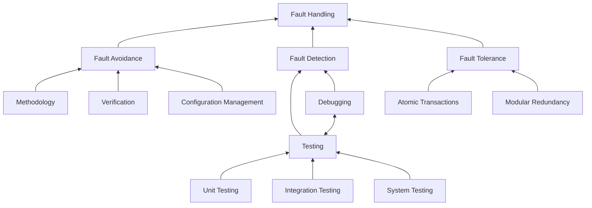

## Failure

Any deviation of the observed behavior from the specified behavior is a failure.

## Erroneous state

    Error

When the system is in an erroneous state, further processing by the system can lead to a [[failure|ser216.software-testing.terminology#Failure]].

## Fault

    Bug
    Defect

A fault, bug, or defect is the mechanical or algorithmic cause of an [[error|ser216.software-testing.terminology#Erroneous state]].

## Validation

Validation is the activity of checking for deviations between the observed behavior of a system and its specification.

## Examples

- **Faults in the interface specification**
    - Mismatch between what the client needs and what the server offers
    - Mismatch between requirements and implementation
- **Algorithmic faults**
    - Missing initialization
    - Incorrect branching condition
    - Missing test for `null`
- **Mechanical faults** (most difficult to find)
    - Operating temperature outside of equipment's specifications
- **Errors**
    - `null` reference errors
    - Concurrency errors
    - Exceptions
    
## Dealing with errors, failures, and faults

- **Modular redundancy**
    - Adding additional components to a system to mitigate the failure of a component by reproducing the behavior of the component in a different environment
        - Example: Adding a backup battery to a laptop
- **Declaring the bug as a feature** (doing nothing)
- **Patching**
    - Addressing the error by modifying the code
- **Testing**
    - Adding additional tests to the system to ensure that the error is not reintroduced

### Another view on dealing with faults

- **Fault avoidance**
    - Done before system is released
    - Use methodology to reduce complexity
    - Use configuration management to prevent inconsistency
    - Apply verification to prevent algorithmic faults
- **Fault detection**
    - Done while system is running
    - Testing to detect faults
    - Debugging to find and resolve faults
    - Monitoring to deliver information about state of system
- **Fault tolerance**
    - Done after system failure
    - Exception handling
    - Modular redundancy

## Taxonomy for fault handling

