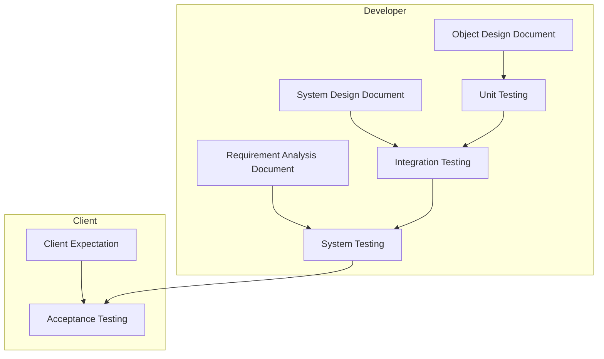

- It is impossible to completely test any nontrivial module in a system
    - Practical limitations
        - Complete testing is prohibitive in time and cost
    - Theoretical limitations
        - e.g. halting problem
- "Testing can only show the presence of bugs, not their absence" (Dijkstra)
- Testing is not free

## Testing takes creativity

- To develop an effective test, one must have...
    - Detailed understanding of the system
    - Application and solution domain knowledge
    - Knowledge of the testing techniques
    - Skill to apply testing techniques
- Testing is best done by independent testers
    - We often develop a certain mental attitude that the problem should behave a certain way when it does not
    - Programmers often stick to the data set that makes the program work
    - A program often does not work when tried by somebody else

## Testing activities

