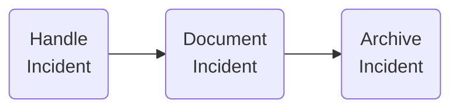

An activity diagram is a special case of a state chart diagram. The states are activities ("functions"). This diagram is useful for depicting the workflow in a system.

^main
## Use-cases
A variety of content can be modeled with activity diagrams, including [[ser216.uml.diagrams.activity.decisions]], [[ser216.uml.diagrams.activity.concurrency]], and [[ser216.uml.diagrams.activity.grouping]].
## Difference between state-chart diagrams
- State-chart diagrams focus on the set of attributes of a single abstraction (object, system)
    - 
- Activity diagrams focus on the data flow in a system
    - 