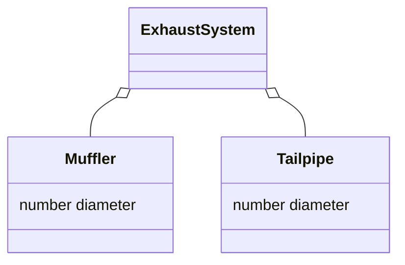
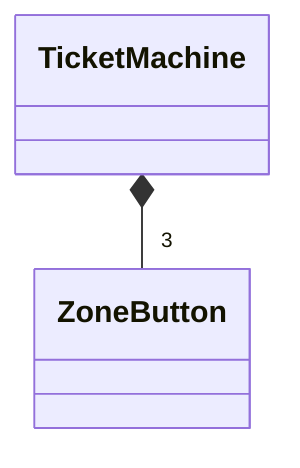

A special case of association denoting a "conists-of" hierarchy.

The aggregate is the parent class, and the components are children classes

^main
## Composition
A string form of aggregation denoted by a solid diamond.

The lifetime of component instances are controlled by the aggregate (they cannot exist independently).

