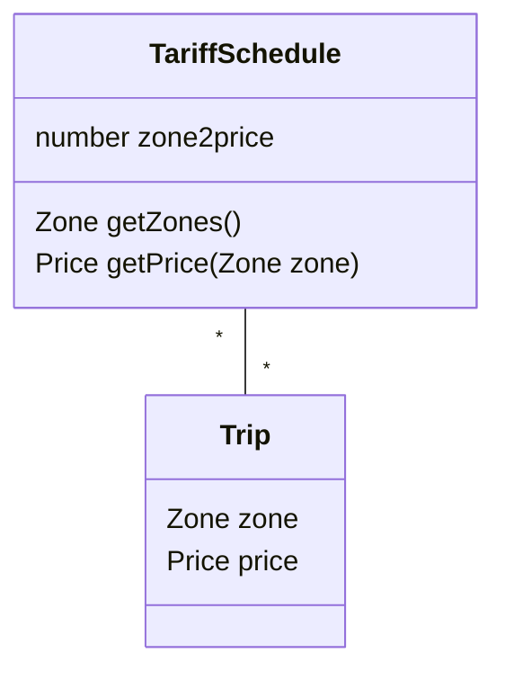

Class diagrams represent the structure of the system.

## When are Class Diagrams used?
- During requirements analysis to model application domain concepts
- During system design to model subsystems
- During object design to specify the detailed behavior and attributes of classes

## What is a class?
![[ser216.class#^main]]
## Associations
![[ser216.uml.diagrams.class.associations#^overview]]
## Aggregation
![[ser216.uml.diagrams.class.aggregation#^main]]
## Inheritance
![[ser216.uml.diagrams.class.inheritance#^main]]
## Packages
![[ser216.uml.things.grouping#package]]