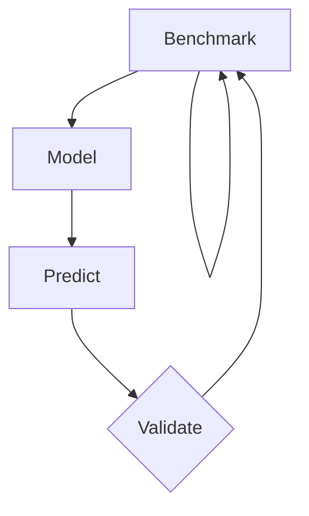

## In a nutshell
```Java
int pool = new int[n];
for (int i = 0; i < pool.length; i++)
    pool[i] = random.nextInt(100);
```
Run on 10 elements: 20 sec.

Run on 20 elements: 40 sec.

$$
f(n)\approxeq2n
$$
Provides an approximate solution that's good enough for analyzing
## Empirical process
1. Benchmark the runtime of the application
2. Construct a mathematical model (e.g. regression)
3. Use the model to predict results
4. Validate model against results

## Benchmarking example