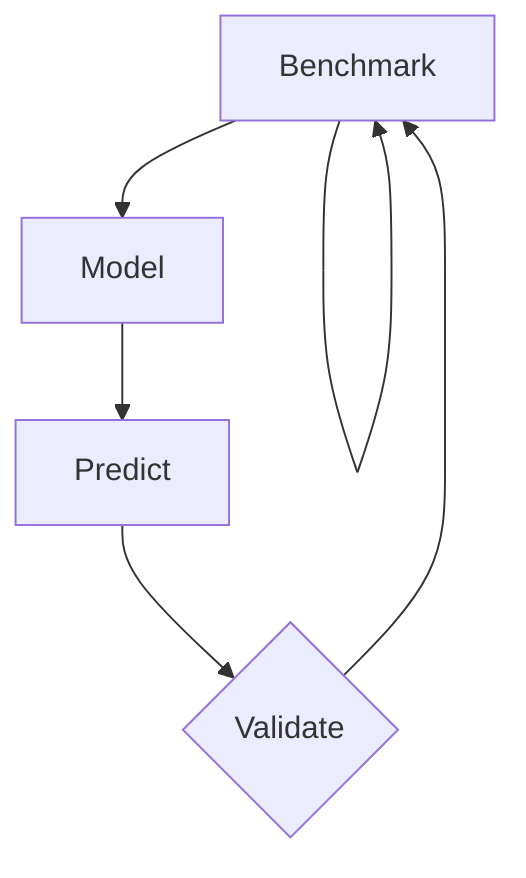

## In a nutshell
```Java
int pool = new int[n];
for (int i = 0; i < pool.length; i++)
    pool[i] = random.nextInt(100);
```
Run on 10 elements: 20 sec.

Run on 20 elements: 40 sec.

$$
f(n)\approxeq2n
$$
Provides an approximate solution that's good enough for analyzing
^main
## Empirical process
1. Benchmark the runtime of the application
2. Construct a mathematical model (e.g. regression)
3. Use the model to predict results
4. Validate model against results

## Benchmarking example
The threesum problem
```Java
//Sedgewick and Wayne
public static int threeSum(int[] a) {
    int N = a.length;
    int count = 0;
    for (int i = 0; i < N; i++)
        for (int j = i+1; j < N; j++) 
            for (int k = j+1; k < N; k++)
                if (a[i] + a[j] + a[k] == 0)  
                    count++;
    return count;
}
```
(A brute force technique to check for triples that sum to zero in an input list)
- Looks like $O(n^3)$ because of the 3 for-loops
- Stopwatch is a simple way to benchmark in Java
    - ```Java
      int[] a = {23, 32, 5, 103, 12, 10, ...};
      Stopwatch stopwatch = new Stopwatch();
      System.out.println(ThreeSum.count(a));
      double time = stopwatch.elapsedTime();
      System.out.println("elapsed " + time);
      ```
- To benchmark, run the program multiple times, use the correct input sizes, and aggregate results to create a growth function
- 
## Is an empirical growth function good enough?
- It is useful as it can be performed without access to source code
- Results are limited to only a specific context
- Performance may not be repeatable on the same system
