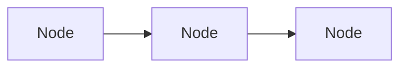

An array made up of [[nodes|ser222.node]] that store a value and the next element. This can easily be expanded upon but comes at a cost of access times.
```Java
var list = new LinkedList<int>();
list.add(13); // O(1)
list.getSize(); // O(n) unless size is cached
list.remove(0); // O(1)
list.add(12);
list.get(0); // O(n)
```
## Structure

Linked Lists are made up of "links" of [[nodes|ser222.node]] that point to each-other. This makes access times `O(n)`, as a Linked List will only store the head of the list.
```Java
interface LinkedList<T> extends Collection<T> {
    Node<T> head;
    void addFirst(T element);
    void addLast(T element);
    T removeFirst(T element);
    T removeLast(T element);
    T getFirst(T element);
    T getLast(T element);
}
```
The [[Double-Linked List|ser222.double-linked-list]] uses [[nodes|ser222.node]] that reference both the `next` and `previous` [[nodes|ser222.node]] and have faster access times `O(1)` for the first elements of the list.

## Resizing
As mentioned before, Linked Lists have the advantage of `O(1)` resizing, making them ideal for use in [[stacks|ser222.stack]].