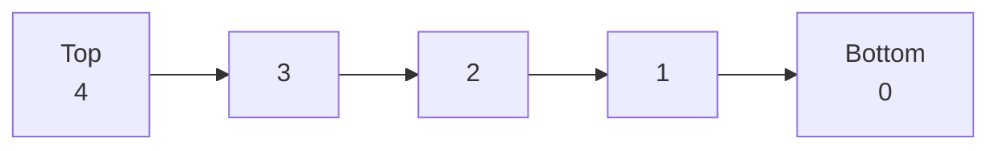
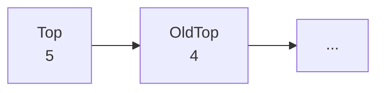
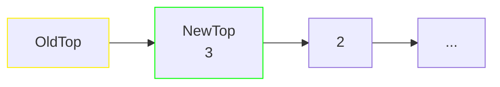

A data structure that can have elements added/removed in `O(1)`. This is generally implemented via a [[ser222.linked-list]].

```Java
public interface Stack<T> {
    /** Pushes a new item to the top of the stack */
    void push(T item);
    /** Removes the topmost item from the stack and returns it */
    T pop();
    boolean isEmpty();
    int size();
}
```
## Linked-Stack
If implemented with an [[ser222.array]], the `push()` method can be `O(n)`, as the array needs to be occasionally resized. If implemented through a [[ser222.linked-list]], all methods are `O(1)`.

To push to the stack, a new `Top` node is created, setting the linked list's reference to the new `Top` and that node's `next` to the previous `Top` (`4` in this example)

```Java
...
public void push(T element) {
    var newTop = new Node<T>(element);
    newTop.next = top; // this may also be handled by a setter
    top = newTop;
}
...
```
To remove an element (in Java), you have to set the current head to the top's `next` property and let the garbage collector do the rest. Although `OldTop` may still reference the `NewTop`, this no longer matters as there is no longer a way to access `OldTop`.

```Java
...
public T pop() {
    var oldTop = top;
    top = top.next; // this may also be handled by a getter
    return oldTop.value; // this may also be handled by a getter
}
...
```