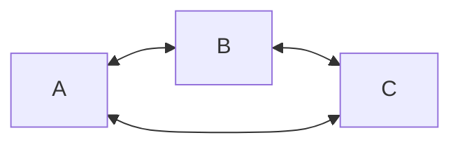
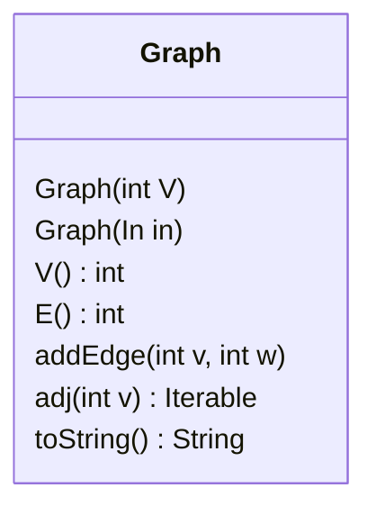
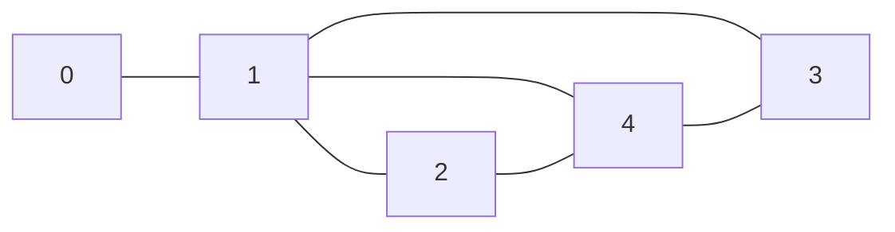
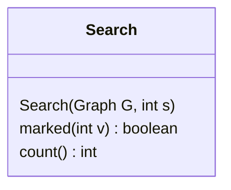
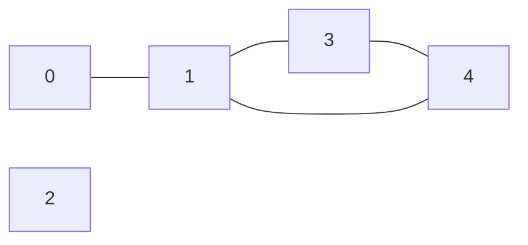
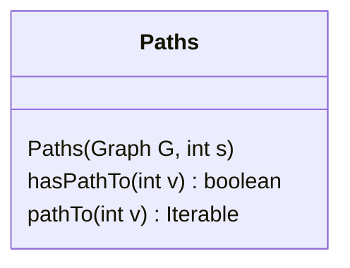

## Terminology

- Graphs
    - [[Directed|ser222.directed-graphs]] vs [[undirected|ser222.undirected-graphs]]
    - Vertices (angular points, adjacent)
    - Edges (lines, incident)
- Self-looping nodes
    - Nodes that are connected in such a way that a "loop" exists when the node is traversed
- Parallel edges
    - Edges that are incident to the same node

## Basic idea

- Graphs are similar to linked lists and trees, but they have no defined order



## Graph API



### Compute the degree of a vertex

```java
public int degree(Graph g, int v) {
    int degree = 0;
    for (int w : g.adj(v))
        degree++;
    return degree;
}
```

### Count number of self-loops

```java
public int numberOfSelfLoops(Graph g) {
    int count = 0;
    for (int v = 0; v < g.V(); v++)
        for (int w : g.adj(v))
            if (v == w)
                count++;
    return count / 2;
}
```

## Implementing the graph ADT

- Ideally we want
    - Low space usage: linear
    - Fast to add edges: constant
    - Fast to find edge on vertex: linear
- We also want to support
    - Self-loops
    - Parallel edges
- Possible implementations
    - Adjacency matrix
    - Adjacency list
    
### Adjacency matrix

For a graph of $V$ vertices, make a $V$ by $V$ matrix, where each index corresponds directly to an edge



|   | 0 | 1 | 2 | 3 | 4 |
|---|---|---|---|---|---|
| 0 |   | T |   |   |   |
| 1 | T |   | T | T | T |
| 2 |   | T |   |   | T |
| 3 |   | T |   |   | T |
| 4 |   | T | T | T |   |

- Requires $V^2$ space
- Supports self-loops
- Supports parallel edges

### Adjacency list

For a graph of $V$ vertices, mane an array of $V$ linked lists, where each index corresponds to a list of vertices that are connected to that index.


- Requires $V+E$ space
- Supports self-loops
- Supports parallel edges
- Difficult to check if nodes are connected in constant time
- Uses significantly less space than a matrix

## Searching

- Given an undirected graph, are two vertices connected?



- This API is a little overboard for solving the problem, but it makes for a better UML diagram



```java
var search = new Search(G, s);
System.out.println(search.count()); // 3
System.out.println(search.marked(4)); // true
System.out.println(search.marked(2)); // false
```

- In other languages, this would probably be more easily implemented as a function
    - Or, `Graph` could implement the `Search` interface

### Depth-first search

1. Start at some node
2. Mark it as visited
3. Recursively visit each of its neighbors if they are not marked

```java
private void dfs(Graph G, int v) {
    marked[v] = true;
    count++;
    for (int w : G.adj(v))
        if (!marked[w])
            dfs(G, w);
}
```

### Implementation

```java
public class DepthFirstSearch implements Search {
    private boolean[] marked;
    private int count;

    public DepthFirstSearch(Graph G, int s) {
        marked = new boolean[G.V()];
        dfs(G, s);
    }

    private void dfs(Graph G, int v) { ... }

    public boolean marked(int w) {
        return marked[w];
    }

    public int count() {
        return count;
    }
}
```

## Pathing

- Given an undirected graph, are two vertices connected?



- DFS can easily be extended to find all paths
    - However, it may not be the ideal solution
    - DFS may find *a* path, but not necessarily the shortest


- When used on the above nodes, DFS might find the path `0 -> 1 -> 3 -> 4`
    - This is **not** the shortest path
- BFS, although slower, would observe *all* possible paths, and would always find the shortest path; `0 -> 1 -> 4`

```java
var paths = new Paths(G, s);
System.out.println(paths.hasPathTo(2)); // false
System.out.println(paths.hasPathTo(4)); // true
for (var v : paths.pathTo(4))
    System.out.println(v); // 0, 1, 4 (DFS could fail to find this)
```

### Using DFS

- New variable is `edgeTo
    - Gets updated for each call in `dfs`

```java
private void dfs(Graph G, int v) {
    marked[v] = true;
    for (int w : G.adj(v)) {
        if (!marked[w]) {
            edgeTo[w] = v;
            dfs(G, w);
        }
    }
}
```

- This is **not** the shortest path!

### Breadth-first search

1. Start at some node
2. Mark it as visited
3. Add its neighbors to a queue if they are not marked
4. Remove the first node from the queue and mark it as visited
5. Add its neighbors to the queue if they are not marked
6. Repeat step 4 until the queue is empty

```java
private void bfs(Graph G, int s) {
    Queue<Integer> queue = new Queue<>();
    marked[s] = true;
    queue.add(s);
    while (!queue.isEmpty()) {
        int v = queue.remove();
        for (int w : G.adj(v)) {
            if (!marked[w]) {
                edgeTo[w] = v;
                marked[w] = true;
                queue.add(w);
            }
        }
    }
}
```

### Implementation

```java
public class BreadthFirstPaths implements Paths {
    private boolean[] marked;
    private int[] edgeTo;
    private int s;

    public BreadthFirstPaths(Graph G, int s) {
        marked = new boolean[G.V()];
        edgeTo = new int[G.V()];
        this.s = s;
        bfs(G, s);
    }

    private void bfs(Graph G, int v) { ... }

    public boolean hasPathTo(int v) {
        return marked[v];
    }

    public Iterable<Integer> pathTo(int v) {
        if (!hasPathTo(v))
            return null;
        Stack<Integer> path = new Stack<>();
        for (int x = v; x != s; x = edgeTo[x])
            path.push(x);
        path.push(s);
        return path;
    }
}
```

## BFS vs DFS

- Both algorithms solve the same problem
- DFS extends the current path using the newest node
- BFS looks at the oldest node first
- BFS is safer for graphs with an unknown or potentially near-infinite number of nodes
- DFS is better for traversing small graphs with a known number of nodes