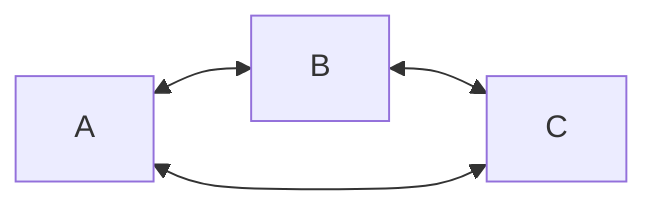
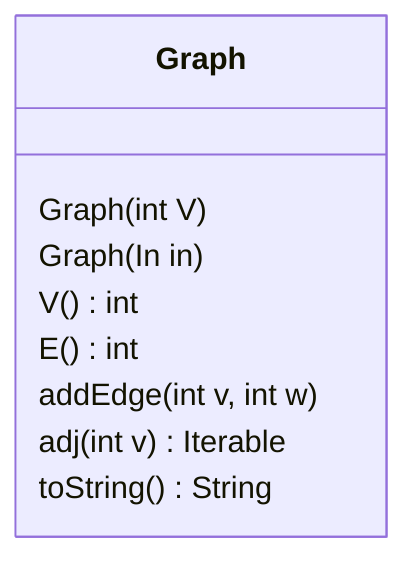
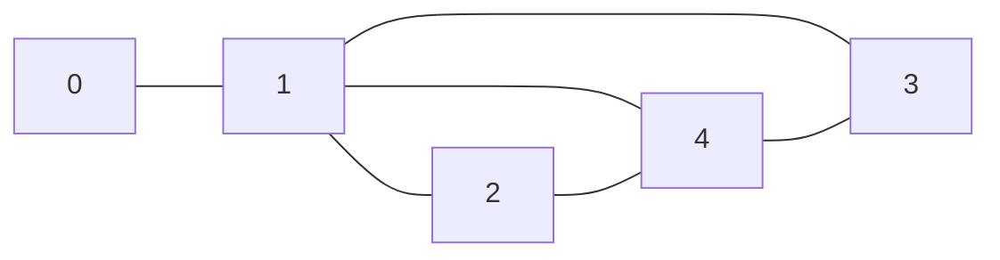

## Terminology

- Graphs
    - [[Directed|ser222.directed-graphs]] vs [[undirected|ser222.undirected-graphs]]
    - Vertices (angular points, adjacent)
    - Edges (lines, incident)
- Self-looping nodes
    - Nodes that are connected in such a way that a "loop" exists when the node is traversed
- Parallel edges
    - Edges that are incident to the same node

## Basic idea

- Graphs are similar to linked lists and trees, but they have no defined order



## Graph API



### Compute the degree of a vertex

```java
public int degree(Graph g, int v) {
    int degree = 0;
    for (int w : g.adj(v))
        degree++;
    return degree;
}
```

### Count number of self-loops

```java
public int numberOfSelfLoops(Graph g) {
    int count = 0;
    for (int v = 0; v < g.V(); v++)
        for (int w : g.adj(v))
            if (v == w)
                count++;
    return count / 2;
}
```

## Implementing the graph ADT

- Ideally we want
    - Low space usage: linear
    - Fast to add edges: constant
    - Fast to find edge on vertex: linear
- We also want to support
    - Self-loops
    - Parallel edges
- Possible implementations
    - Adjacency matrix
    - Adjacency list
    
### Adjacency matrix

For a graph of $V$ vertices, make a $V$ by $V$ matrix, where each index corresponds directly to an edge



|   | 0 | 1 | 2 | 3 | 4 |
|---|---|---|---|---|---|
| 0 |   | T |   |   |   |
| 1 | T |   | T | T | T |
| 2 |   | T |   |   | T |
| 3 |   | T |   |   | T |
| 4 |   | T | T | T |   |

### Adjacency list

For a graph of $V$ vertices, mane an array of $V$ linked lists, where each index corresponds to a list of vertices that are connected to that index.


```mermaid
flowchart LR
    subgraph 0
        01[1]
    end
    n0[0] --> 01
    subgraph 10
        10[0]
    end
    n1[1] --> 10
    subgraph 21
        21[1]
    end
    n2[2] --> 21
    subgraph 31
        31[1]
    end
    n3[3] --> 31
    subgraph 41
        41[1]
    end
    n4[4] --> 41
```