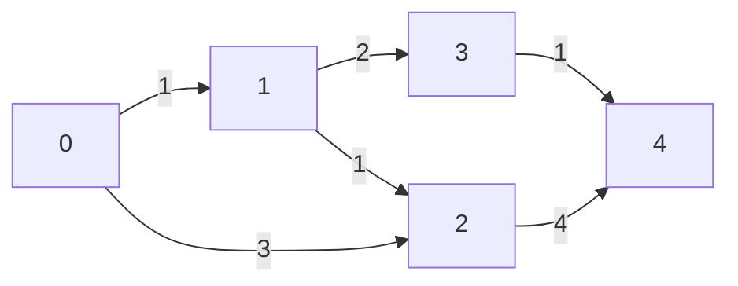

Weighted graphs assign a weight to each edge rather than just a boolean value. This takes up more space, but allows for more realistic graphs.

## Edges with attributes

- We will create a simple class to hold the attributes of each edge

```java
public class DirectedEdge {
    private final int v;
    private final int w;
    private final double weight;

    public DirectedEdge(int v, int w, double weight) {
        this.v = v;
        this.w = w;
        this.weight = weight;
    }

    public double weight() {
        return weight;
    }

    public int from() {
        return v;
    }

    public int to() {
        return w;
    }

    public String toString() {
        return String.format("%d->%d %.2f", v, w, weight);
    }
}
```

## Revisiting directed graph ADT

- There are some small modifications to the [[Directed Graph|ser222.directed-graphs]] that we will make to make it work with weighted edges

```java
public interface EdgeWeightedGraph {
    int V(); // number of vertices
    int E(); // number of edges
    void addEdge(DirectedEdge e); // add edge v->w
    Iterable<DirectedEdge> adj(int v); // vertices connected to v from edges v->x
    Iterable<DirectedEdge> edges(); // all edges
    String toString(); // string representation of graph
}
```

## Shortest path

- A path between two nodes is the shortest if there is no other path with a smaller weight

### Relaxation

- Pick a node
- If it provides a shorter way to reach its neighbors, then update the neighbors

```java
private void relax(EdgeWeightedDigraph G, int v) {
    for (DirectedEdge e : G.adj(v)) {
        int w = e.to();
        if (distTo[w] > distTo[v] + e.weight()) {
            distTo[w] = distTo[v] + e.weight();
            edgeTo[w] = e;
        }
    }
}
```



Example of situation where relaxing would be needed to find the shortest path.

### Dijkstra's algorithm

- We need to relax each node in a graph
    - The issue is that we need them to relax them in an order that gives us the shortest path
- Idea:
    - Maintain a list of nodes that we have not yet relaxed
    - Pick out the node with the smallest distance
    - Relax it
    - Remove it from the list
    - Repeat until all nodes have been relaxed

```java
private void dijikstra(EdgeWeightedDigraph G, int s) {
    distTo = new double[G.V()];
    edgeTo = new DirectedEdge[G.V()];
    for (int v = 0; v < G.V(); v++) {
        distTo[v] = Double.POSITIVE_INFINITY;
    }
    distTo[s] = 0.0;
    pq = new IndexMinPQ<>(G.V());
    pq.insert(s, distTo[s]);
    while (!pq.isEmpty()) {
        int v = pq.delMin();
        for (DirectedEdge e : G.adj(v)) {
            int w = e.to();
            if (pq.contains(w) && distTo[w] > distTo[v] + e.weight()) {
                distTo[w] = distTo[v] + e.weight();
                edgeTo[w] = e;
                if (pq.contains(w)) pq.decreaseKey(w, distTo[w]);
                else pq.insert(w, distTo[w]);
            }
        }
    }
}
```